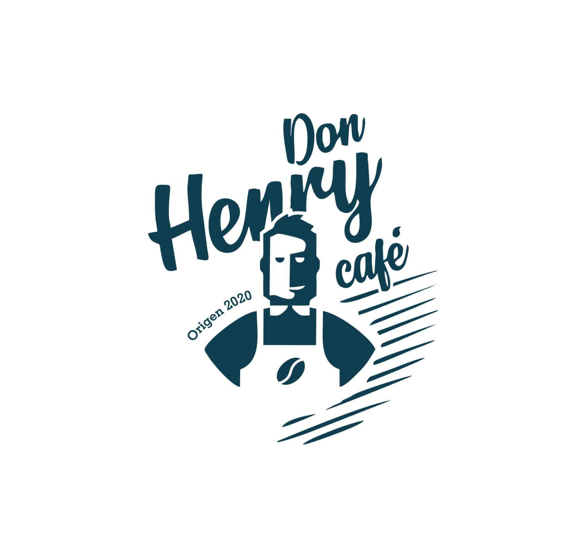

<div align="center">


[](#tech-stack)

<h3 align="center"><b>Don Henry Café</b> - App Example</h3>
   <p align="center">
   Open Source. Front-end.
   </p>

[Demo](https://don-henry-cafe-frontend.vercel.app/) · [Related Projects](#related-projects) · [Request Feature](#report-bug)

</div>

## Table of Contents

- [React + Vite](#react--vite)
    - [Installation](#installation)
  - [Resources](#resources)
  - [License](#license)
  - [Report Bug](#report-bug)

## Overview


Don Henry Café is a complete open source system for the management of orders and orders for different coffee-based products to be picked up at the store or delivered to your home

This is an example of the app that shows how `Don Henry Café` is built with react app.

crear la Build usando create react app.

You can build it by yourself

### Features

- Login, Register, Forgot Password, Logout
- Profile
- History Order
- Products (Search, Sort, Filter)
- Cart
- Admin Dashboard
- Manage Order (Admin)
- etc.

## Tech Stack

- [React](https://react.dev/) & [React Router DOM](https://reactrouter.com/en/main)
- [Redux](https://redux.js.org/) & [Redux Persist](https://www.npmjs.com/package/redux-persist) (Local Storage)
- [TailwindCSS](https://tailwindcss.com/) & [DaisyUI](https://daisyui.com/)
- [React Hot Toast](https://www.npmjs.com/package/react-hot-toast)
- [Vercel](https://vercel.com/dashboard) for deploying demo
- etc.

## Getting Started

### Prerequisites

# React + Vite

This template provides a minimal setup to get React working in Vite with HMR and some ESLint rules.

Currently, two official plugins are available:

- [@vitejs/plugin-react](https://github.com/vitejs/vite-plugin-react/blob/main/packages/plugin-react/README.md) uses [Babel](https://babeljs.io/) for Fast Refresh
- [@vitejs/plugin-react-swc](https://github.com/vitejs/vite-plugin-react-swc) uses [SWC](https://swc.rs/) for Fast Refresh

You need to install some software to run this project

- [Node.js](https://nodejs.org/en/download) (LTS version recommended, 14 or newer)

### Installation

1. Clone this repository to your local

   ```bash
   git clone https://github.com/lisethgira/donHenryCafe.git
   ```

2. Change current directory

   ```bash
   cd donHenryCafe
   ```

3. Install dependencies

   If you using npm

   ```bash
   npm install
   ```

   If you using yarn

   ```bash
   yarn
   ```

4. Setup environment

   ```env
   VITE_REACT_APP_BACKEND_HOST = (your rest api host)
   VITE_REACT_APP_WEBSITE_NAME = (your project name)
   ```

5. Running app

   ```bash
   npm start
   ```

<!-- ## Screenshots

<div style="display:flex;flex-wrap:wrap;gap:0.5rem">
 


</div> -->

## Resources

Special thanks for providing resources such as icons and images.

- [Flaticon](https://flaticon.com/)
- [unDraw](https://undraw.co/)
- [SVGRepo](https://svgrepo.com/)
- and other sources.

If there are resources that belong to you, please let me know, I will write it here.

## License

This project is licensed under the ISC License. See the [LICENSE](LICENSE) file for details.

## Report Bug

Any error report you can pull request
or contact:

- [Liseth Giraldo](https://github.com/lisethgira)
- [Jose Ortiz](https://github.com/Josed1804)
- [Francisco Cordoba](https://github.com/frankc2812)
- [Carolina Escudero](https://github.com/ESCUDERO457)
